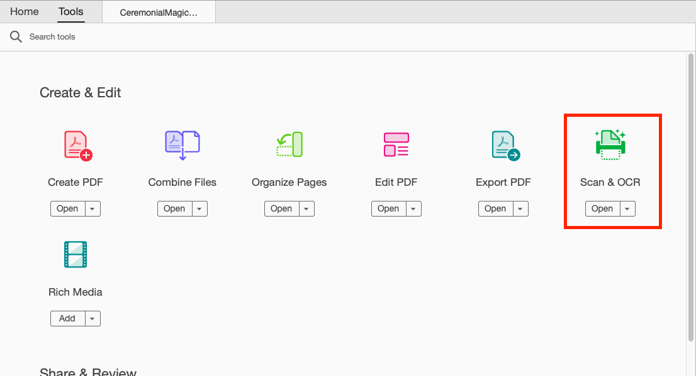
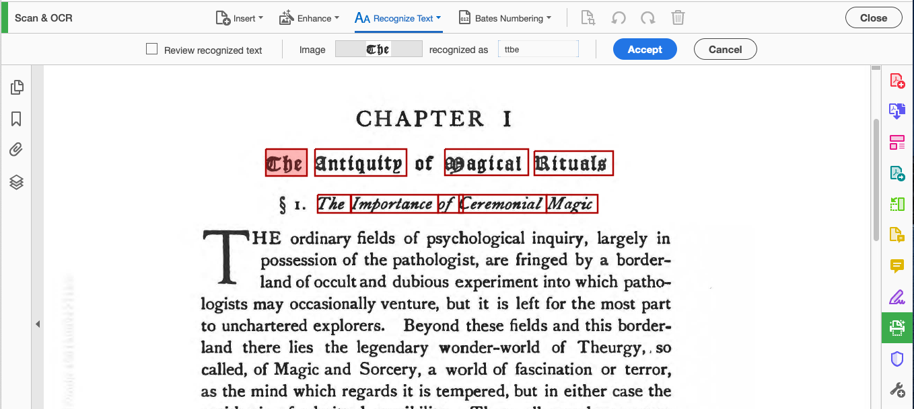

### OCR with Adobe Acrobat

Adobe Acrobat is a great entry-level tool for OCR. It works best for good quality PDFs (we'll use ABBYY on our ugly PDFs). It's also free for all current Yale students, faculty, and staff.

>## First Steps with Acrobat
>
>* In the sample data, go to the 'Acrobat' folder and open 'CeremonialMagic_1.pdf' in Adobe Acrobat.
>	* Right_click filename
>	* Select 'Open with' and choose Adobe Acrobat
>	* If this is your first time using Acrobat, you will be asked to sign-in to your account. Use your Yale crendaentials (NetID & password). 
>* Select 'Scan & OCR' from the 'Tools' menu.
> 
>* Click the 'Recognize Text' drop-down.
>	* Change 'Settings' and 'language' if necessary.
>	* Click the blue 'Recognize Text' button to begin OCR.
{: .checklist}

### Fixing errors

Acrobat cannot be 100% accurate with it's OCR. It will highlight words with when it's confidence in the accuracy of the OCR is low. We can manually verify and edit any OCR text.  

>## Correct Text
>
>1. Click the 'Recognize Text' drop-down.
>	* Select 'Correct recognized text'
>2. Each word with a low confidence rating will appear in a red box.
>	
>	* Click on words in box.
>	* Correct transcription as necessary.
>	* Selct 'Apply' and move to the next potential error.
{: .checklist}

### Viewing the Text

After we OCR any PDF, we create a hidden text layer. While invisiable to us, this text layer allows us to copy/paste and search the recognized text. 

>## Hidden Text
>
> We can view the hidden text layer in Acrobat as an additional means of quality control.
>
>1. While the 'Correct recognized text' option is open, check the box for 'Review recognized text'. 
>	* This option will show us the hidden text layer on top of the image of the text.
>2. Now we can edit the text for each word, not just the words that Acrobat identified as potential errors.
>
{: .checklist}

You'll notice in our example PDF there are several words which are incorretly recognized. These were not identified by Acrobat as potenital issues. It's important to remember that 100% accuracy with OCR software is nearly impossible.

### Bulk processing

>## Using the 'Action Wizard'
>
>Adobe provides a way to create workflows through the Action Wizard. We can save these workflows and apply them to multiple PDFs or entire folders of PDFs.
>1. From 'Tools', select 'Action Wizard'
>	
>2. In the next menu, select 'New Action'
>3. There are several settings to change to complete our worflow
>	* Under 'Files to be processed, choose the 'Acrobat' folder. This is the folder where your PDFs to recognize are saved.
>	* From 'Recognize Text', add 'Recognize Text using OCR'.
>	* Under 'Save & Export', add 'Save' twice.
>	* Choose 'Specify Settings' and change 'Output Format' to 'Export File(s) to Alternative Format' and select 'Text (Plain)' form the 'Export to:' drop-down list.
>	
>4. Rename the process and click 'Save'. We can now apply these steps to any folder and Acrobat will OCR each file and save two versions: one PDF and one Text file.
>
{: .checklist}