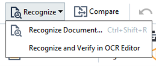
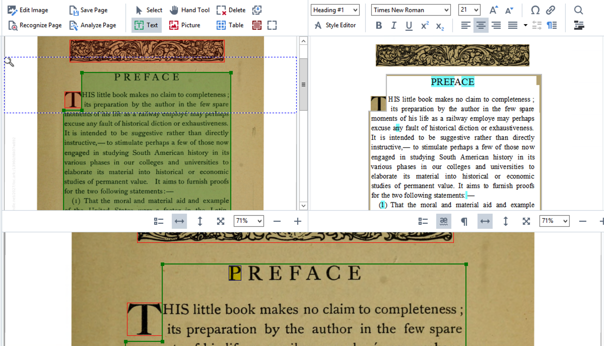
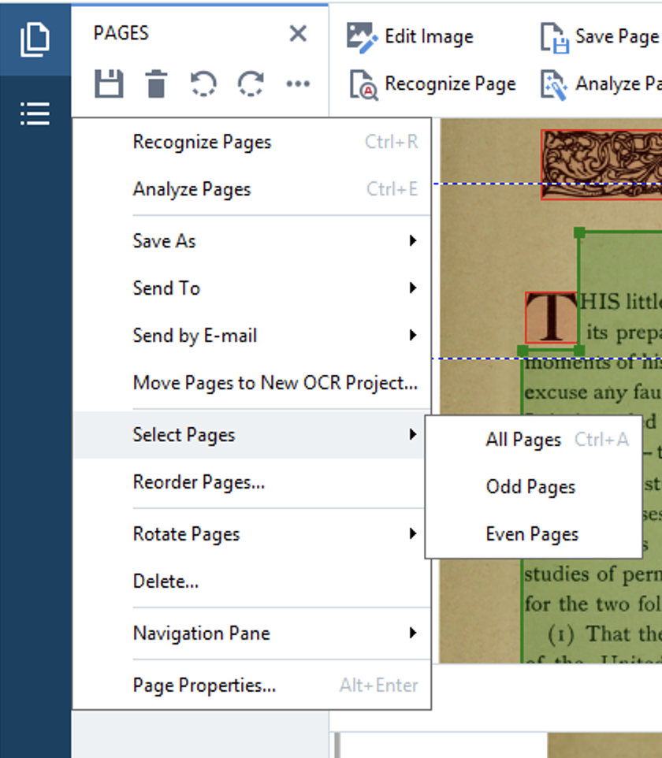

### Enhancing PDFs to improve OCR accuracy

* Even the best qualtiy scan can cause OCR issues. There are several stategies for editing a PDF to help improve OCR quality:
    * Removing background color (black text on a white background).
    * Increasing contrast
    * Straightening & de-skewing text
    * Removing noise or extraneous marks

### OCR with ABBYY Finereader

* ABBYY Finereader for quick conversion of PDFs, including basic OCR
* ABBYY OCR Editor for more OCR options, custom pattern recognition, language selection, and more. 

>## Getting Started with ABBYY
>
>1. Right-click on PDF named 'InterAmerican.pdf', select Open with ABBYY FineReader 14.
>2. Click the 'Recognize Text' drop-down and select 'Open in OCR Editor'.
> 
{: .checklist}

### Viewing OCR output

* After the OCR process is complete, we can compare the original document to the text-only version.
* ABBYY highlights potential errors in blue. We can manually correct or edit the text data before saving/exporting for greater QA.

**Spend a few minutes manually correcting and verifying highlighted text.** 

### Improving OCR Quality

* ABBYY provides a built-in image editor to correct scans increasing the legibility of the text. 
* The default option will try to intellegently correct the image so the OCR engine can more easily recognize text. You can also edit the scans manually. 

>## Using the Image Editor
>1. Right-click on PDF named 'PlantPestsCT.pdf', select Open with ABBYY FineReader 14. 
>2. Click the 'Recognize Text' drop-down and select 'Open in OCR Editor'.
>	- You'll see the recognized text quality is very low. We can use the built-in image editing tools to improve the accuracy of the OCR. 
>3. Click 'Image Editor'. This will open a new interface in ABBYY for editing images to improve OCR quality.
>4. There are several tasks we can do to improve the OCR quality:
>	- Crop out non-essential features
>	- Change background color to white
>	- Increase contrast or brightness
>	- de-skew words/lines
>	- Remove noise & marks
{: .checklist}

* Edits can be applied to a single page, even or odd pages, or all pages.

### Creating Templates

Area templates allow us to identify all the text boxes on one page and apply an identical layout to other pages. We can even save these templates for use in other ABBYY projects.

>## Create an Area Template
>
> Many times, the text blocks of scanned books do not line up in the center of the scan. Often, the text for even vs odd pages will be aligned differently on the page. We can account for this with our templates.
>
>1. Choose page 2 and draw a green text box around the main block of text. 
>	- Right-click on any existing grenn text boxes and select 'Delete'. These boxes contain, page numbers, watermarks, and other text we don't want to include (note this will also ignore any images on the page).
>2.  Choose 'Area' from the top menu and select 'Save Area Template'.
>	- Name the template 'trees_even.blk' and save.
>3.  Now select page 3 and repeat the steps 1 and 2 above.
>	- Name the template 'trees_odd.blk'
>4. From the 'Pages' toolbar, click the three dots, 'Select Pages', and then 'Even Pages'.
>	
>5. With the even pages highlighted, choose 'Area' from the top menu, select 'Load Area Template', and choose 'trees_even.blk'.
>6. Repeat steps 4 and 5 using the odd pages and odd tamplate.
>7. 'Recognize' the text again and see how the output changes.
>
{: .checklist}